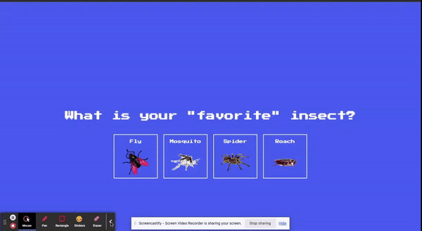

# Insect Catch Game

Welcome to **Catch The Insect**, an interactive web game where you can catch your favorite insects and see how many you can collect before the game gets too difficult. This project combines HTML, CSS, and JavaScript to create a fun and challenging experience for players.
## Deployed Link
[Deployed link here](https://mdawood11.github.io/insect-catch-game/)

## Demo

## Gameplay

**1. Start the Game**
When you click the "Start Game" button, you'll be taken to the second screen where you can select your favorite insect from the provided options. Choose wisely!

**2. Catch the Insects**
Once you've selected your favorite insect, you'll be taken to the third screen where your selected insect will appear. Now the fun begins! Click on your insect to catch it. Each time you catch an insect, two more insects will appear on the screen.

**3. Reach the Challenge**
Your goal is to reach a score of 20. Once you achieve this score, a message will appear asking if you're annoyed because you're playing an impossible game! You can choose to continue or stop the game.

## Game Over

The game ends in two ways:

- If you choose to stop the game at any point.
- If you reach a score of 20 and decide to continue or not.
